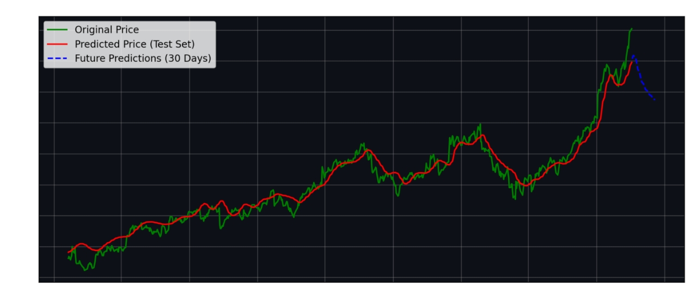

# Stock Market Predictor – LSTM Model

## Overview
Stock Market Predictor is a web application that predicts future stock prices using a pre-trained **LSTM model**. It allows users to visualize historical stock data, compare predicted prices with actual prices, and forecast prices for the next 30 trading days.  

Built using:
- Python  
- Keras (LSTM)  
- Streamlit  
- Yahoo Finance API (`yfinance`)  
- Matplotlib  

---

##  Features
- Input any stock symbol (e.g., `AAPL`, `GOOG`, `TSLA`).  
- Select start date for analysis.  
- Display historical stock prices.  
- Predict stock prices for test set and next 30 trading days.  
- Unified visualization of original, predicted, and future prices.  
- Investment insights including:
  - Last available price  
  - Highest & lowest prices  
  - Average & standard deviation  
  - Expected price & expected change after 30 days  

---

## How It Works
1. Input stock symbol and start date.  
2. Download historical data from Yahoo Finance.  
3. Split data into train (80%) and test (20%).  
4. Scale data for LSTM input.  
5. Predict prices for test set and next 30 days.  
6. Visualize trends and predictions.  
7. Show investment insights for decision-making.  

---

## Investment Insights Example

| Metric | Value |
|--------|-------|
| Last Available Price | 180.38 USD |
| Highest Price in Test Period | 180.38 USD |
| Lowest Price in Test Period | 18.82 USD |
| Average Price in Test Period | 67.51 USD |
| Price Std Dev in Test Period | 31.06 USD |
| Expected Price after 30 Days | 128.65 USD |
| Expected Average Price Next 30 Days | 142.45 USD |
| Expected Price Std Dev Next 30 Days | 10.65 USD |
| Expected Change in 30 Days | -51.73 USD (-28.68%) |

> Note: Predictions are based on historical patterns. Market events and news are not included.

---

## How to Run Locally

git clone https://github.com/mariam851/stock-market-predictor.git
cd stock-market-predictor
pip install -r requirements.txt
streamlit run app.py
